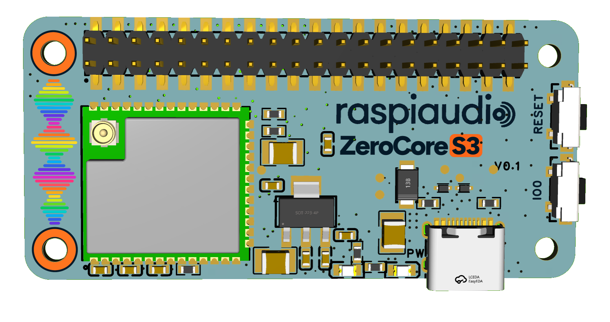

# ZeroCore S3

An ESP32-S3 controller in a Raspberry Pi Zero-style footprint, designed to pair with [RASPIAUDIO Voice DSP+](https://github.com/RASPIAUDIO/Voice-DSP-Plus). It brings Wi-Fi, Bluetooth Low Energy, USB programming and a 40-pin interface to projects that need a compact controller. In the Voice DSP+ setup, the ESP32 runs ESPHome and the local wake word; audio processing and speaker playback are handled by Voice DSP+.

This repository contains the board's public user documentation: [40-pin pinout](docs/pinout.md) and [functional block diagram](docs/block-diagram.md). Circuit schematics and PCB design files are not published here.

## At a glance

| Feature | ZeroCore S3 |
| --- | --- |
| Module | ESP32-S3-WROOM-1U-N16R8 |
| CPU | Dual-core Xtensa LX7, up to 240 MHz |
| Memory | 16 MB flash, 8 MB PSRAM, 512 KB internal SRAM |
| Wireless | 2.4 GHz Wi-Fi and Bluetooth Low Energy; external antenna connector |
| USB | USB-C for 5 V power and ESP32 programming/data |
| Expansion | 40-pin, 2.54 mm header with 3.3 V GPIO, I2C, I2S, SPI and UART |
| Controls | BOOT/IO0 and RESET buttons; power indicator |
| Board size | 65 x 30.7 mm; Raspberry Pi Zero-style mounting arrangement |

An external antenna is included with the [standalone board](https://raspiaudio.com/product/corezero-s3/). Voice DSP+, speaker, power supply and Home Assistant server are separate.

## Getting started

1. Locate physical pin 1 using the markings on the board and check the [pinout](docs/pinout.md) before connecting a 40-pin cable or another board.
2. Connect the external antenna before using Wi-Fi or Bluetooth.
3. Supply 5 V through USB-C or the header, according to your assembly. Power down both boards before stacking or changing cables.
4. For the Voice DSP+ satellite, follow the [Home Assistant / ESPHome setup](https://github.com/RASPIAUDIO/raspiaudio.github.io/tree/main/ZeroCoreS3/HomeAssistant).

For a radio build, the [Digital Radio shield ESP32 application](https://github.com/RASPIAUDIOadmin/Digital-Radio-for-Raspberry-Pi/tree/main/esp32/zerocore_s3_digital_radio)
documents the GPIO mapping, firmware build and serial controls. FM reception
and analog audio were validated with the shield attached to a ZeroCore S3.
The application's README records the current DAB limitations.

The header has a familiar physical layout, but its signals are **ESP32-S3 signals**. Raspberry Pi software GPIO numbers and HAT compatibility do not follow from the connector shape. The GPIO are 3.3 V logic; do not apply 5 V to a GPIO or the 3V3 pins. Pins 26 (GPIO0) and 37 (GPIO3) are boot strapping pins, so external circuits must not force the wrong level during reset. The 5 V power path was designed with a 3 A target, but that is not a measured continuous current rating for an assembled product.

The public documentation describes the September 2026 board design. The latest privately archived user edits have not been through a final fabrication, electrical and thermal qualification. Check your board revision and assembly before relying on a particular pin or power limit.

## Links

- [Voice DSP+ documentation](https://github.com/RASPIAUDIO/Voice-DSP-Plus)
- [ZeroCore S3 product page](https://raspiaudio.com/product/corezero-s3/)
- [Home Assistant integration](https://github.com/RASPIAUDIO/raspiaudio.github.io/tree/main/ZeroCoreS3/HomeAssistant)
- [Digital Radio shield application](https://github.com/RASPIAUDIOadmin/Digital-Radio-for-Raspberry-Pi/tree/main/esp32/zerocore_s3_digital_radio)
