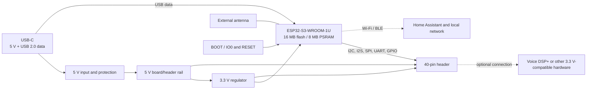

# Functional block diagram

The ESP32-S3 handles connectivity and the application running on the controller. In the Voice DSP+ satellite, microphone processing, acoustic algorithms and speaker amplification are on the separate Voice DSP+ board. Home Assistant runs elsewhere on the network.

USB-C supplies a conventional 5 V input; this board does not negotiate USB Power Delivery. The 5 V header pins share the board's 5 V power domain. Review the supply arrangement before connecting another powered board: do not assume two independent 5 V sources can be paralleled safely. The block diagram explains function, not individual component connections or a current rating.
